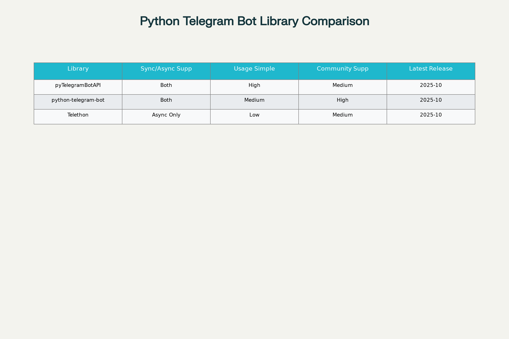
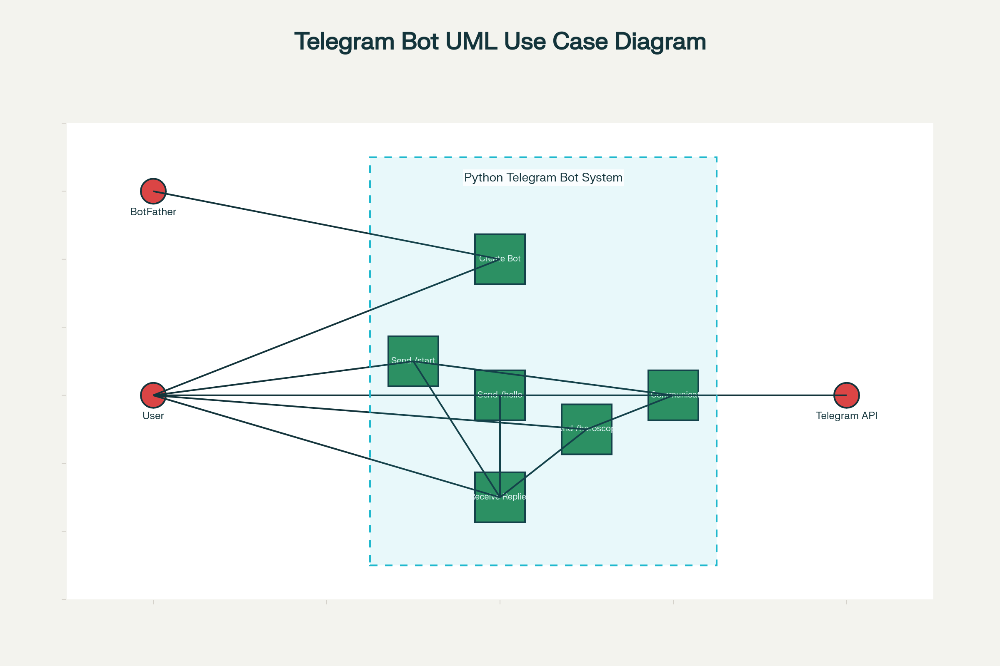
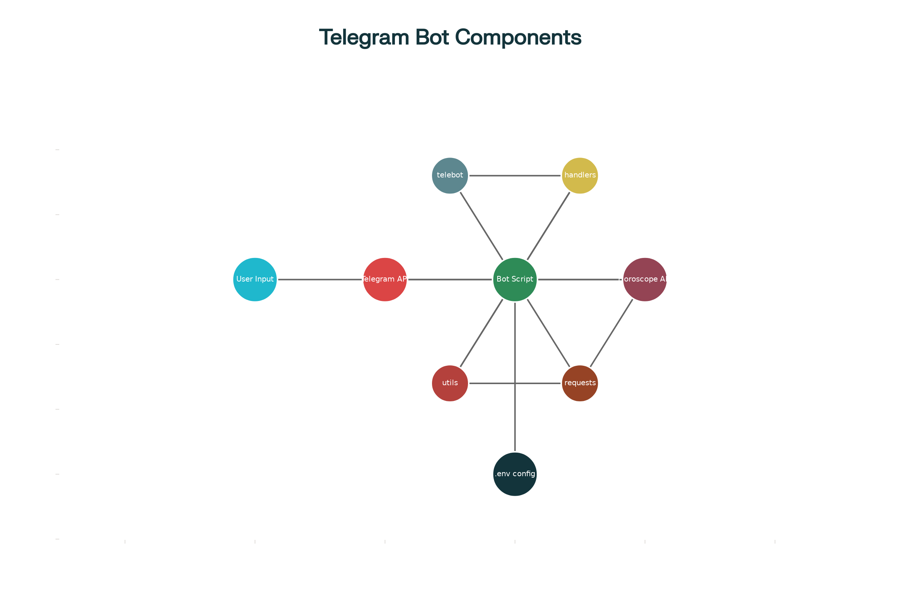
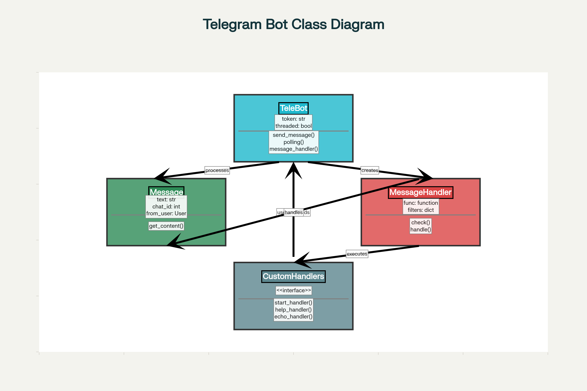
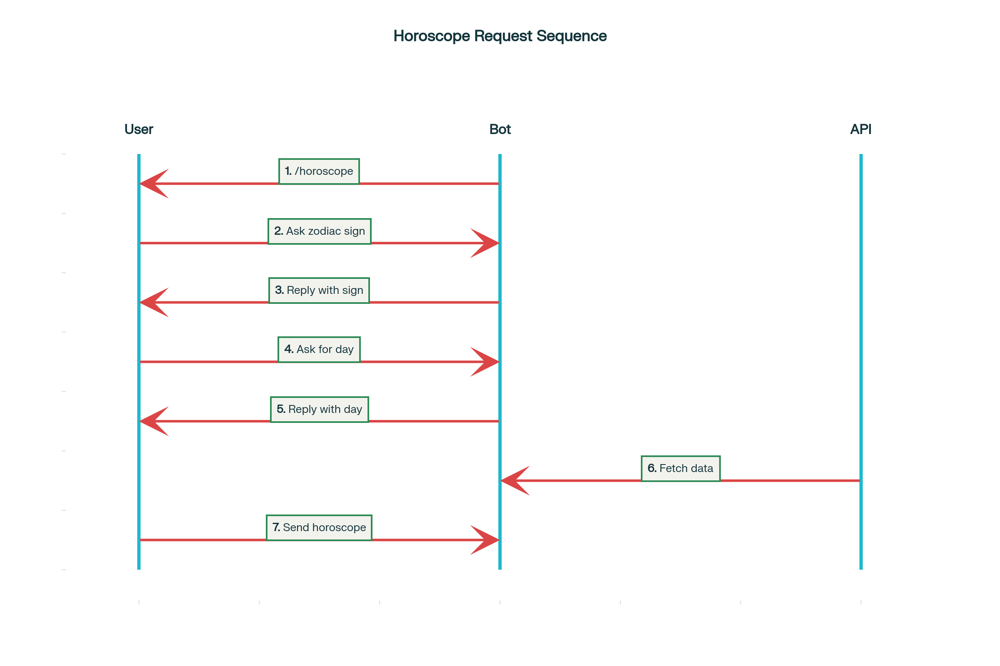
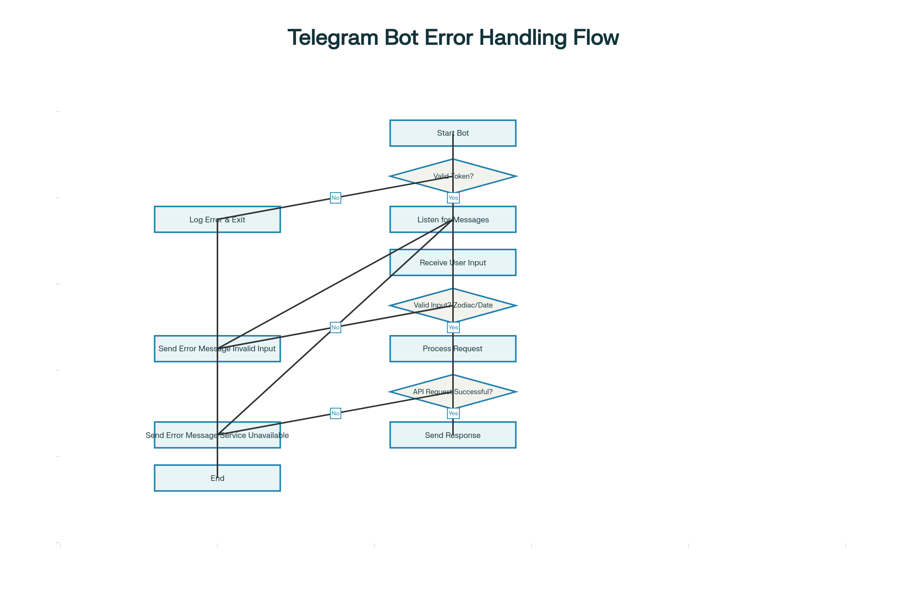

# План выполнения задания по созданию Telegram-бота на Python

**Этапы исследования и реализации:**

1. **Изучение предметной области:**
    - Что такое Telegram-боты, зачем они нужны, где применяются.
    - Обзор популярных Python-библиотек для создания ботов: pyTelegramBotAPI, python-telegram-bot, Telethon.
2. **Получение токена для бота:**
    - Взаимодействие с BotFather в Telegram.
    - Создание нового бота, получение и хранение токена.
3. **Настройка среды разработки:**
    - Установка Python, pip.
    - Установка pyTelegramBotAPI: `pip install pyTelegramBotAPI`
    - Настройка `.env` файла с токеном.
4. **Разработка базового Telegram-бота:**
    - Импорт необходимых модулей.
    - Инициализация объекта TeleBot с токеном.
    - Реализация обработчиков команд `/start`, `/hello`, эхо-ответа.
5. **Реализация функционала гороскопа:**
    - Получение знака зодиака и дня от пользователя через цепочки сообщений.
    - Запрос к стороннему Horoscope API для получения гороскопа.
    - Обработка и отправка ответа пользователю.
6. **Обработка ошибок и исключительных ситуаций:**
    - Неверный токен, ошибки API, некорректный ввод пользователя.
7. **Визуализация архитектуры:**
    - UML-диаграммы: Use Case, Component, Sequence, Class, Activity (или Flowchart).
    - Таблица для сравнения библиотек.
    - Схемы взаимодействия и архитектуры.
8. **Модификация проекта:**
    - Добавление обработки запроса погоды.
    - Добавление обработки свободных запросов с помощью LLM GigaChat
9. **Документирование и оформление проекта:**
    - Markdown: подробное техническое руководство и туториал.
    - Экспорт в HTML-формат.
    - Размещение документации в репозитории.

***

## Пошаговое выполнение

### 1. Исследование предметной области

- Telegram-бот — это приложение, работающее внутри чата Telegram, с которым взаимодействует пользователь через команды и сообщения.
- Основные варианты реализации на Python:


| Библиотека | Синхронность | Простота | Комьюнити | Актуальность |
| :-- | :-- | :-- | :-- | :-- |
| pyTelegramBotAPI | Оба режима | Высокая | Средняя | 2025-10 |
| python-telegram-bot | Оба режима | Средняя | Высокая | 2025-10 |
| Telethon | Асинхронная | Низкая | Средняя | 2025-10 |




***

### 2. Получение токена у BotFather

1. Найти в Telegram пользователя **@BotFather**.
2. Запустить диалог, отправить команду `/newbot`.
3. Следовать инструкциям, получить уникальный токен для нового бота.
4. Сохранить токен в `.env`-файл:

```
BOT_TOKEN=your-bot-token-here
```
Рекомендуется использовать загрузку переменных окружения из файла `.env` через библиотеку `python-dotenv`.


![UML Use Case Diagram: User, BotFather, and Telegram Bot Interactions]

 

UML Use Case Diagram: User, BotFather, and Telegram Bot Interactions

***

### 3. Подготовка Python-среды

- Установить Python ≥ 3.8 и pip.
- Установить зависимости:

```
pip install pyTelegramBotAPI requests python-dotenv
```

- Создать `.env` для токенов/ключей и подключить его через `python-dotenv`.
  Пример содержимого:

  ```
  BOT_TOKEN=your-telegram-bot-token
  GIGACHAT_CLIENT_ID=your-client-id
  GIGACHAT_CLIENT_SECRET=your-client-secret
  GIGACHAT_AUTH_URL=https://ngw.devices.sberbank.ru:9443/api/v2/oauth
  GIGACHAT_URL=https://gigachat.devices.sberbank.ru/api/v1/chat/completions
  GIGACHAT_MODELS_URL=https://gigachat.devices.sberbank.ru/api/v1/model
  # Необязательно: модель по умолчанию
  GIGACHAT_MODEL=GigaChat-2-Max
  YANDEX_GEOCODE_API_KEY=your-yandex-geocode-key
  YANDEX_GEOCODE_URL=https://geocode-maps.yandex.ru/1.x/
  YANDEX_WEATHER_API_KEY=your-yandex-weather-key
  YANDEX_WEATHER_URL=https://api.weather.yandex.ru/v2/informers
  HOROSCOPE_API_URL=https://horoscope-app-api.vercel.app/api/v1/get-horoscope/daily
  ```

***

### 4. Разработка базового Telegram-бота

```python
# bot.py
import os
import telebot

BOT_TOKEN = os.environ.get('BOT_TOKEN')
bot = telebot.TeleBot(BOT_TOKEN)

@bot.message_handler(commands=['start', 'hello'])
def send_welcome(message):
    bot.reply_to(message, "Howdy, how are you doing?")

@bot.message_handler(func=lambda msg: True)
def echo_all(message):
    bot.reply_to(message, message.text)

bot.infinity_polling()
```


#### Структура проекта:

- bot.py — основной скрипт
- .env — токен

![Component Diagram: Python Telegram Bot Project]



Component Diagram: Python Telegram Bot Project

![Class Diagram: Core Classes in pyTelegramBotAPI-Based Bot]



Class Diagram: Core Classes in pyTelegramBotAPI-Based Bot

***

### 5. Функционал гороскопа

#### Получение данных по API

```python
import requests

def get_daily_horoscope(sign: str, day: str) -> dict:
    url = "https://horoscope-app-api.vercel.app/api/v1/get-horoscope/daily"
    params = {"sign": sign, "day": day}
    response = requests.get(url, params)
    return response.json()
```


#### Диалог с пользователем

```python
@bot.message_handler(commands=['horoscope'])
def sign_handler(message):
    text = text = ("Какой твой знак зодиака?\nВыбери один: Овен, Телец, Близнецы, Рак, Лев, Дева, Весы, Скорпион, Стрелец, Козерог, Водолей, Рыбы.")
    sent_msg = bot.send_message(message.chat.id, text, parse_mode="Markdown")
    bot.register_next_step_handler(sent_msg, day_handler)

def day_handler(message):
    sign = message.text
    text = ("Какой день вам нужен?\nВыберите один: СЕГОДНЯ, ЗАВТРА, ВЧЕРА, "
            "или дату в формате ГГГГ-ММ-ДД.")
    sent_msg = bot.send_message(message.chat.id, text, parse_mode="Markdown")
    bot.register_next_step_handler(sent_msg, fetch_horoscope, sign.capitalize())

def fetch_horoscope(message, sign):
    day = message.text
    horoscope = get_daily_horoscope(sign, day)
    data = horoscope["data"]
    horoscope_message = (
        f'*Horoscope:* {data["horoscope_data"]}\n*Sign:* {sign}\n*Day:* {data["date"]}'
    )
    bot.send_message(message.chat.id, "Вот ваш гороскоп!")
    bot.send_message(message.chat.id, horoscope_message, parse_mode="Markdown")
```

![Sequence Diagram: Getting a Horoscope via Telegram Bot]



Sequence Diagram: Getting a Horoscope via Telegram Bot

***

### 6. Обработка ошибок

- Проверять корректность токена при запуске.
- Проверять статус ответа сервера API.
- Проверять ввод пользователя (существуют ли такие знаки и формат даты).

![Flowchart: Telegram Bot Error Handling]



Flowchart: Telegram Bot Error Handling

***

### 7. Визуализация архитектуры

- Диаграммы (см. выше): Use Case , Component , Sequence , Class , Таблица , Flowchart.
- В помощь начинающим — каждую диаграмму/схему сопровождать пояснением.

***

### 8. Модификация проекта (творческий пункт)

**Добавление логирования:**

- Создать лог-файл, записывать туда все входящие запросы и ответы.
- В обработчиках добавить:

```python
import logging

logging.basicConfig(filename='bot.log', level=logging.INFO)
logging.info(f"User: {message.chat.id}, Text: {message.text}")
```


**Интеграция с LLM GigaChat**

- Доступ осуществляется по client-credentials (client_id/client_secret) и токену, полученному через OAuth.
- Все сообщения, не являющиеся командами, перенаправляются в GigaChat через `GigaChatClient`.

Встраивание в обработчик сообщений
```python
@bot.message_handler(func=lambda msg: not msg.text.startswith('/')
                    and not is_horoscope_context(msg) and not is_weather_context(msg))
def llm_reply(message):
    user_query = message.text
    if gigachat_client:
        try:
            resp = gigachat_client.send_chat(user_query)
            answer = resp['choices'][0]['message']['content']
        except Exception as e:
            answer = f"GigaChat error: {e}"
    else:
        answer = "GigaChat не настроен. Обратитесь к администратору."
    bot.reply_to(message, answer)
```

**Получение прогноза погоды через Яндекс API**

- Команда `/weather` инициирует сценарий:
    1. Запрос города
    2. Геокодирование через Яндекс.Карты API (получение координат)
    3. Получение погодного прогноза через Яндекс.Погода API
    4. Возврат результата пользователю
Пример функций для интеграции
```python
def geocode_city(city: str) -> tuple:
    url = "https://geocode-maps.yandex.ru/1.x/"
    params = {
        "geocode": city,
        "format": "json",
        "apikey": "<YANDEX_GEOCODE_API_KEY>"
    }
    res = requests.get(url, params=params).json()
    pos = res['response']['GeoObjectCollection']['featureMember'][0]['GeoObject']['Point']['pos']
    lon, lat = pos.split()
    return float(lat), float(lon)

def get_weather(lat: float, lon: float) -> str:
    url = "https://api.weather.yandex.ru/v2/informers"
    headers = {"X-Yandex-API-Key": "<YANDEX_WEATHER_API_KEY>"}
    params = {"lat": lat, "lon": lon}
    resp = requests.get(url, headers=headers, params=params).json()
    fact = resp['fact']
    weather = f"{fact['temp']}°C, {fact['condition']}"
    return weather
```
Встраивание в обработчик команды
```python
@bot.message_handler(commands=['weather'])
def weather_handler(message):
    sent_msg = bot.send_message(message.chat.id, "Укажите город для прогноза погоды:")
    bot.register_next_step_handler(sent_msg, city_weather)

def city_weather(message):
    city = message.text
    lat, lon = geocode_city(city)
    forecast = get_weather(lat, lon)
    bot.send_message(message.chat.id, f"Погода в {city}: {forecast}")
```

### 9. Документирование и публикация проекта

- Подробное руководство и туториал оформить в Markdown (README.md).
- Иллюстрации внедрить внутрь текста:

```
![UML Use Case Diagram][image:1]
![Component Diagram][image:2]
![Sequence Diagram][3]
![Flowchart][4]
![Comparison Table][5]
![Class Diagram][6]
```

- Использовать Github Pages или другой статический сайт для публикации HTML-версии.
- В репозитории README.md, diagrams/, bot.py, .env.sample, bot.log (лог, если нужен).

***

### Итоговая структура репозитория:

```
project-repo/
├── bot.py
├── .env.sample
├── README.md
├── diagrams/
│   ├── use-case.png
│   ├── component.png
│   ├── horoscope_sequence.png
│   ├── error_flow.png
│   ├── class-diagram.png
│   └── libs-table.png
├── bot.log
```


***
